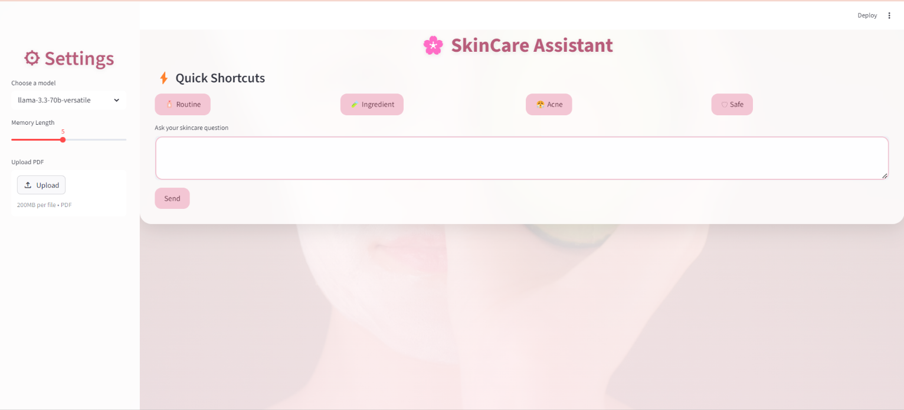

# 🌸 SkinCare Chatbot

An AI-powered skincare assistant chatbot built with Streamlit, LangChain, and Groq API.  
It helps users get personalized skincare advice, routines, and ingredient explanations in a simple and interactive way.

---

## 🚀 Features

- 💬 AI-powered skincare conversation
- 🧴 Generate personalized skincare routines
- 🧪 Explain skincare ingredients scientifically
- 😤 Acne care guidance
- 🛡 Safety and allergy awareness suggestions
- ⚡ Quick shortcut buttons for fast prompts
- 📄 PDF upload for context-based answers
- 🧠 Conversation memory support
- 🌐 Multi-language support (Arabic & English)

---

## 🛠️ Tech Stack

- Python 3
- Streamlit
- LangChain
- Groq API (LLM models)
- Pydantic
- PyPDF
- dotenv

---

## 📂 Project Structure

SkinCare-Chatbot/
│
├── chatbot/
│   ├── app.py
│   ├── core/
│   │   ├── llm.py
│   │   ├── memory.py
│   │   ├── config.py
│   │   └── prompts.py
│   │
│   ├── resolver/
│   │   ├── models.py
│   │   ├── resolver.py
│   │   └── shortcuts.py
│   │
│   ├── assets/
│   │   └── skincare.png
│   │
│   ├── .env
│   └── requirements.txt
│
└── README.md

---
## 📸 UI Preview

- 


---

## Installation & Setup

```bash
git clone https://github.com/Alaa37885/SkinCare-Chatbot.git
cd SkinCare-Chatbot/chatbot
"python -m venv chatbot",
"chatbot\\Scripts\\activate",
"pip install -r requirements.txt",
"streamlit run app.py"
```
---
طط
## Shortcuts 
- /routine → Generate skincare routine

- /ingredient → Explain ingredient

- /acne → Acne guidance

-/safe → Safety check

---
---
## Future Improvements

- User login system

- Database chat storage

- Skin type detection

- Voice input support

- Cloud deployment
---
---

## Authors

- "A'laa Omar"

- "Aya Karam"

- "Amira Emad"

- "Reem Mahmoud"

- "Mariam El sied"

  ---
  ⭐ If you like this project, please star it! 
